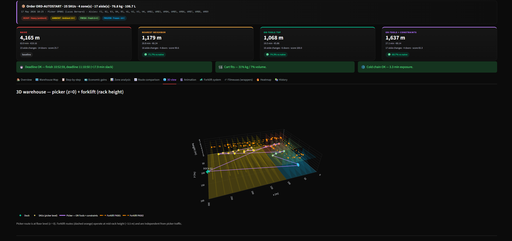

# Picking Route Optimizer V3

[](https://www.python.org/)
[](https://streamlit.io)
[](https://developers.google.com/optimization)
[](https://networkx.org/)
[](https://python-visualization.github.io/folium/)
[](LICENSE)

> Production-grade warehouse picking simulator and route optimizer.
> 300 × 200 m floor plan, 4 thermal compartments, 24 aisles with U-shape
> picking, real French SKU catalog, anti-cold doors with time penalties,
> 4 algorithms compared in real time, multi-operator wave picking,
> separate forklift replenishment system, 8 stretch wrappers, 12 analysis
> tabs.



---

## Features (12 tabs)

1. **Overview** — order summary, distance + zone donut.
2. **Warehouse Map** — Folium dark map, warehouse-only (no world background),
   zone tints, doors highlighted, route arrows, mini-map. Toggle for
   forklift overlay.
3. **Step-by-step** — color-coded picking sequence with cart fill, leg
   distance, door delays.
4. **Economic gains** — annual projection at 60 orders/day × 250 days.
5. **Zone analysis** — SKUs / distance / time per thermal zone.
6. **Route comparison** — 4-way side-by-side mini-maps + cumulative curve.
7. **3D view** — picker route at floor level, forklift route at rack height.
8. **Animation** — Play/Pause walker with live cart weight + volume.
9. **Forklift system** — replenishment dispatch, OR-Tools per-forklift TSP,
   FROZEN > FRESH > AMBIENT > HEAVY priority.
10. **Filmeuses** — 8 stretch wrappers, queue assignment, utilization
    gauges, breakdown simulation.
11. **Heatmap** — pick-frequency heatmap aggregated from history.
12. **History** — last 50 orders, per-operator performance, cumulative
    savings, optimizer adoption rate.

---

## Warehouse layout

```
        300 m wide  →
      ┌─────────────────────────────────────────────────────┐ ▲
      │  FROZEN -18°C  100×60   5 aisles F1..F5            │ │
 200m │ ───❄──[anti-cold door +12s]─────────                │ │
      │  FRESH 0..4°C  100×80   5 aisles R1..R5            │ │
      │ ───❄──[anti-cold door +8s]──────────                │ │  AMBIENT 200×200
      │  HEAVY ambient 100×60   4 aisles H1..H4            │ │  10 aisles AMB1..AMB10
      │              + DOCK-H                                │ │
      └─────────────────────────────────────────────────────┘ ▼
                                                  3 docks → →
                       ↑ 1100+ slots total
                       ↑ U-shape per aisle (odd L / even R)
```

- Each aisle has odd positions on the **LEFT side**, even positions on the
  **RIGHT side**. Pickers walk **DOWN** the odd column then **UP** the
  even column — never doubling back inside an aisle.
- One cross-aisle per zone for skipping ahead.
- Two anti-cold doors at zone boundaries with measured delays
  (8 s and 12 s per pass).
- 4 dispatch docks (3 on the right edge, 1 in the heavy zone).
- 8 stretch wrappers (filmeuses), 2 per zone.

---

## SKU catalog (real French products)

45 real products from 4 categories:

| Zone     | Examples |
|----------|----------|
| FROZEN   | Picard Frites, Marie Lasagnes, Ben & Jerry's Cookie Dough, Findus Épinards… |
| FRESH    | Danone Activia, Président Beurre, Yoplait Nature, Lactel Lait, Chavroux… |
| AMBIENT  | Panzani Farfalle, Barilla Spaghetti, Nutella, Coca-Cola, Heinz Ketchup, Ricard… |
| HEAVY    | Evian 6×1.5L, Ariel 3.3L, Lesieur Olive 5L, Lotus PQ x12, Heineken 24×25cl… |

Each SKU carries brand, name, weight (kg), volume (L), fragility flag and
priority.

---

## Algorithms

| # | Algorithm | What it does |
|---|-----------|--------------|
| 1 | Naive | Walks the order in input sequence (baseline) |
| 2 | Nearest Neighbor | Greedy, ~80 % optimal in milliseconds |
| 3 | OR-Tools TSP | `GUIDED_LOCAL_SEARCH`, 10 s budget, distance-optimal |
| 4 | OR-Tools + constraints | Same engine, but enforces **heavy → ambient → fresh → frozen LAST** ordering, **U-shape per aisle**, and a **time matrix that includes door delays** |

The constrained algorithm pays a small distance overhead vs raw TSP but
typically cuts cold-chain exposure by 60-80 %.

---

## Tech stack

| Layer | Tool |
|-------|------|
| Web UI | Streamlit (12-tab layout) |
| 2D map | Folium + streamlit-folium (CRS=Simple, no world tiles) |
| 3D / animation / charts | Plotly |
| Graph model | NetworkX |
| Optimization | Google OR-Tools (`GUIDED_LOCAL_SEARCH`) |
| Data | pandas, numpy |
| Persistence | JSON file (last 50 orders) |
| Exports | reportlab (PDF + QR), openpyxl, qrcode |

---

## Live Demo

https://picking-route-optimizer.streamlit.app/

---

## Install & run

```bash
git clone <this-repo>
cd picking-route-optimizer
python -m venv .venv
# Windows:    .venv\Scripts\activate
# macOS/Linux: source .venv/bin/activate
pip install -r requirements.txt
streamlit run app.py
```

Opens at <http://localhost:8501> and auto-loads a 25-SKU sample order.

---

## Architecture

```
picking-route-optimizer/
├── app.py                       # 12-tab Streamlit UI
├── requirements.txt
├── README.md
├── core/
│   ├── warehouse.py             # SKU, Order, Warehouse domain
│   ├── catalog.py               # (data/catalog.py) French product catalog
│   ├── doors.py                 # Anti-cold door detection + time penalties
│   ├── graph.py                 # Manhattan distance + time matrix
│   ├── optimizer.py             # 4 algorithms (incl. constrained + U-shape)
│   ├── cart.py                  # 250 kg / 1.5 m³ cart, multi-trip splitter
│   ├── wave_picking.py          # N operators in parallel
│   ├── deadline.py              # SLA check + operator-count recommendation
│   ├── incidents.py             # Blocked aisle / missing SKU / wrapper down
│   ├── forklift.py              # Forklift dispatch + OR-Tools TSP
│   ├── wrappers.py              # 8 stretch wrappers + queue assignment
│   ├── history.py               # JSON history + analytics
│   ├── metrics.py               # Distance, time, cold exposure, doors
│   └── exporters.py             # CSV / Excel / PDF (with QR)
├── visualization/
│   ├── map_view.py              # Folium warehouse map (warehouse-only)
│   ├── view_3d.py               # Plotly 3D rack scene
│   ├── animation.py             # Walker animation
│   ├── heatmap.py               # Pick-frequency heatmap
│   ├── charts.py                # Bar / donut / side-by-side / wrapper gauges
│   └── graph_view.py            # NetworkX node-link diagram
├── data/
│   ├── warehouse_config.py      # Geometry, zones, doors, docks, wrappers
│   ├── catalog.py               # 45 real French products
│   ├── operators.py             # 20 named pickers + 4 forklift drivers
│   └── sample_orders.py         # Random + 4 presets
└── assets/
    └── style.css                # Dark theme polish
```

---

## Author

**Iyad Belkadi**
